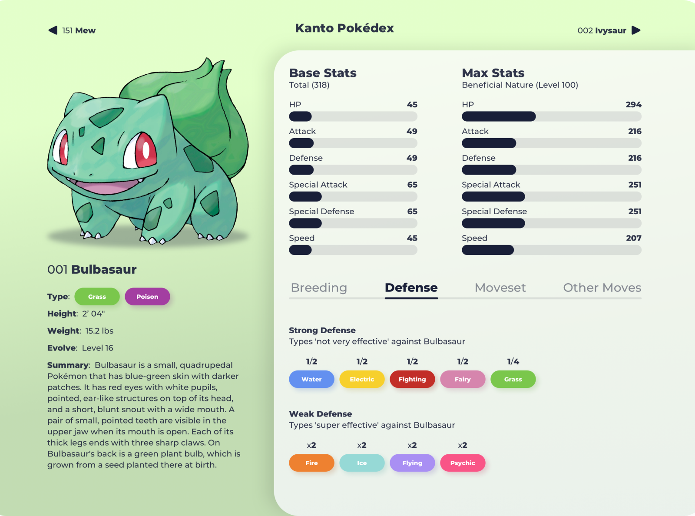
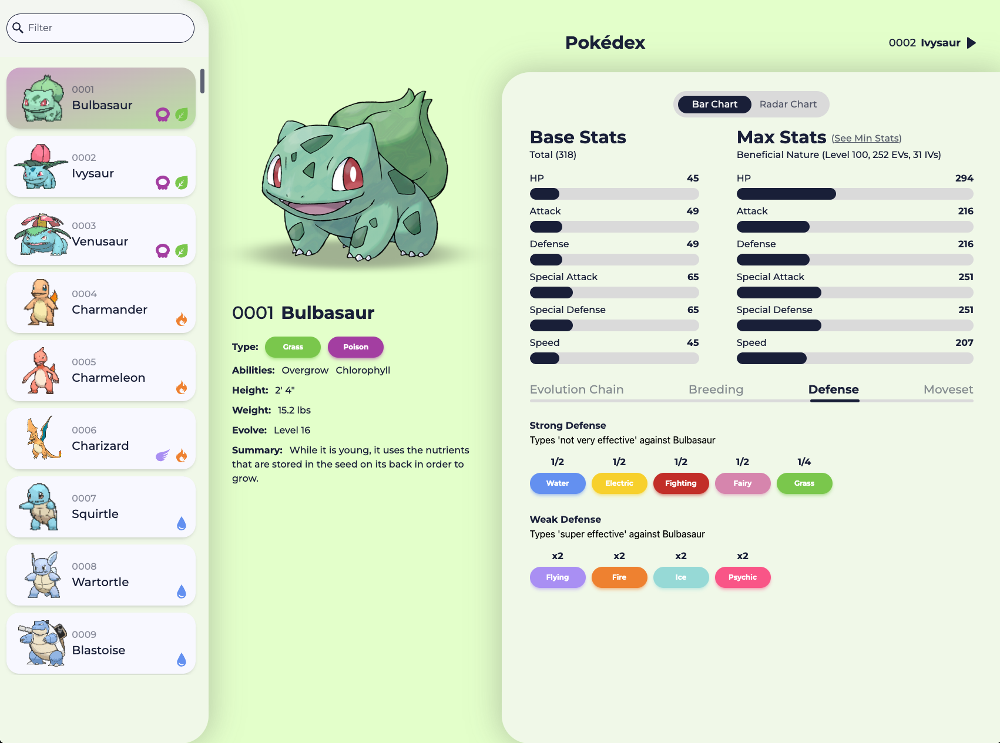
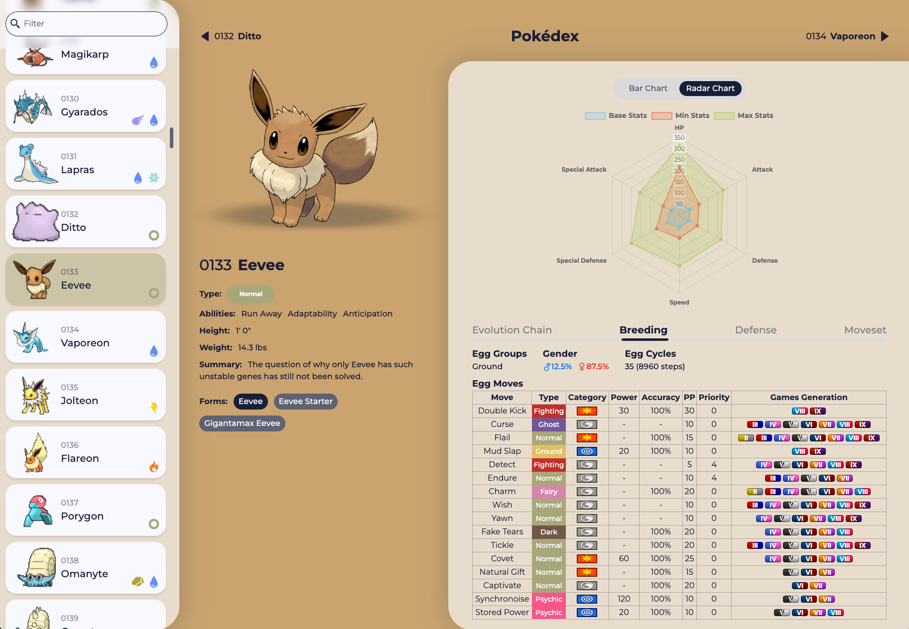
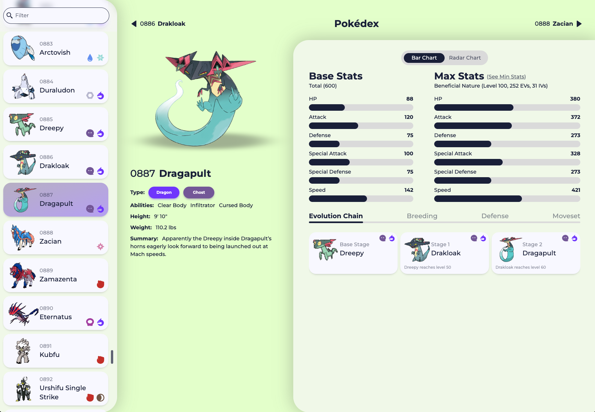
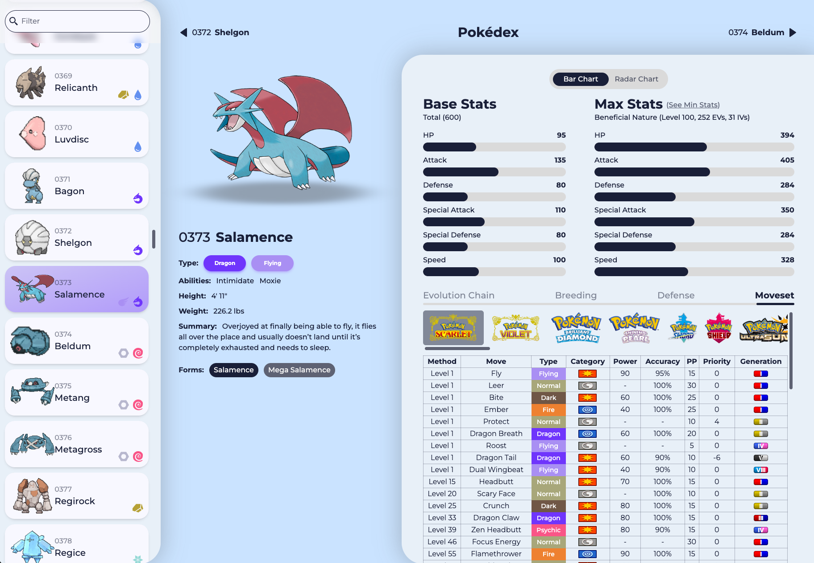
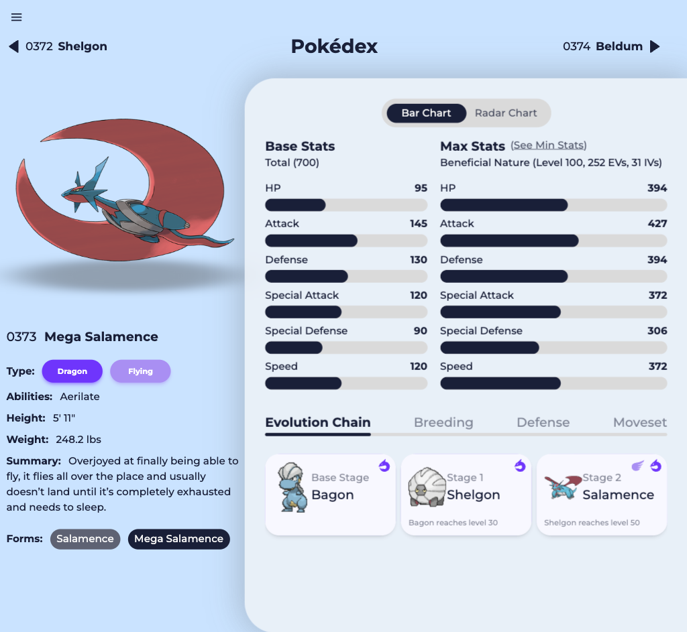
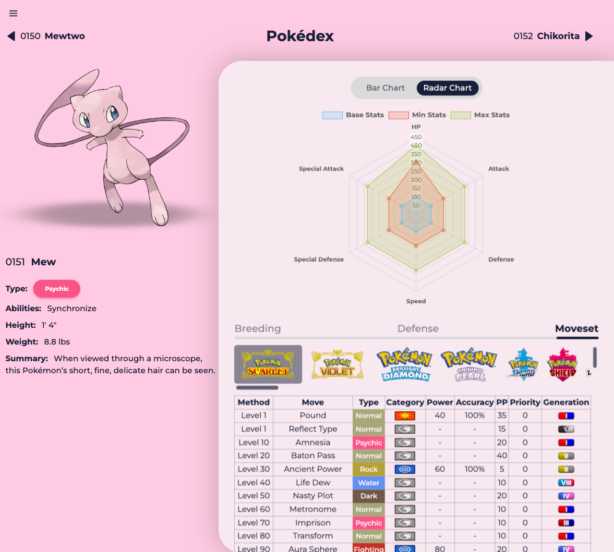
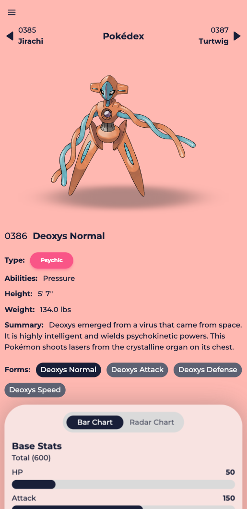
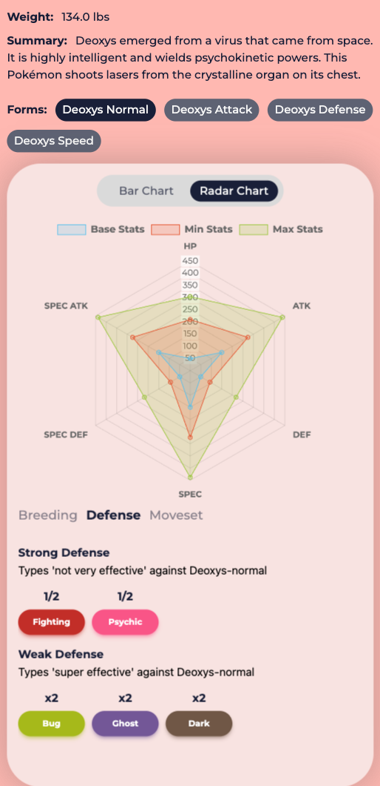
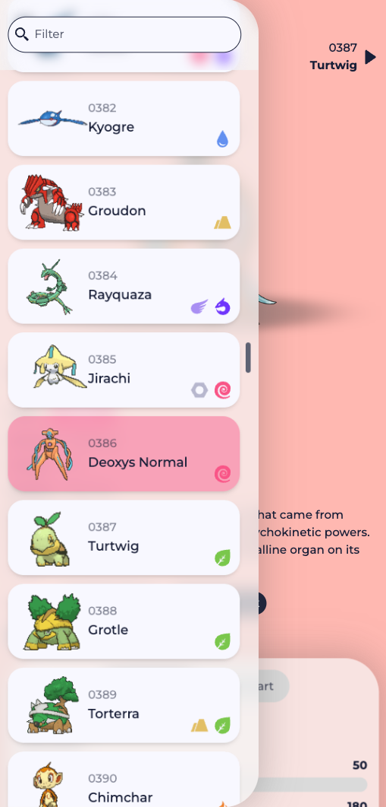

# Pokédex App Documentation

## Introduction

The Pokédex app is a web application built using TypeScript, React, Vite, and TailwindCSS. It allows users to search for Pokémon and view detailed information about each Pokémon, including their stats, evolution chain, resistances, weaknesses, and moves. The app fetches data from the [PokeAPI](https://pokeapi.co/) to provide information about Pokémon.

Live: [https://leurisvg.github.io/pokedex]()

## Design by [Brett Simmons](https://dribbble.com/shots/14972001-001-Bulbasaur)



## Screenshots

<div style="display: flex; flex-wrap: wrap; gap: 10px; margin-bottom: 10px">
  
  
  
  
  
  
</div>

<div style="display: flex; flex-wrap: wrap; gap: 10px">
  
  
  
</div>

## Features

The Pokedex app allows users to:

- Search Pokémon: Search for Pokémon by name using a search bar.
- View Pokemon Details: View detailed information about a specific Pokémon, including:
  - Stats: Base stats of the Pokémon (HP, Attack, Defense, etc.)
  - Evolution Chain: The evolution chain of the Pokémon, showcasing its evolution stages.
  - Breeding: The information about breeding and the moves it can learn through this.
  - Resistances & Weaknesses: The types the Pokémon is resistant and weak to.
  - Moves: The moves the Pokémon can learn, categorized by level learned.
- Visuals: The app displays images of the searched Pokémon and its evolutions.

## Technologies Used

- React
- TypeScript
- Vite
- TailwindCSS

## Credits

The app utilizes various resources. Credit the following sources:

- Design: [Brett Simmons](https://dribbble.com/shots/14972001-001-Bulbasaur)
- Pokémon Games logos: [SteamGridDB](https://www.steamgriddb.com/) | [Pokémon Press Site](https://press.pokemon.com/)
- API: [PokeAPI](https://pokeapi.co/)
- Icons: [Wikidex](www.wikidex.net) | [SVGRepo](https://www.svgrepo.com/) | [SVGCrown](https://svgcrown.com/) | [Boxicons](https://github.com/atisawd/boxicons)
- CSS Snippets: [CodePen - Vinztt](https://codepen.io/vinztt/pen/XjEyvZ) | [CodePen - ChipChocolate](https://codepen.io/chipChocolate/pen/GggMXN)

## Getting Started

To get started with the Pokedex app, follow these steps:

1. Clone the repository:

```
  git clone https://github.com/leurisvg/pokedex.git
```
2. Install dependencies:

```
  npm install
```

3. Run the Development Server:

```
  npm run dev
```

4. Open the App:

Open your web browser and navigate to http://localhost:4200 to view the app.

Feel free to explore the codebase for a deeper understanding of the implementation details.
